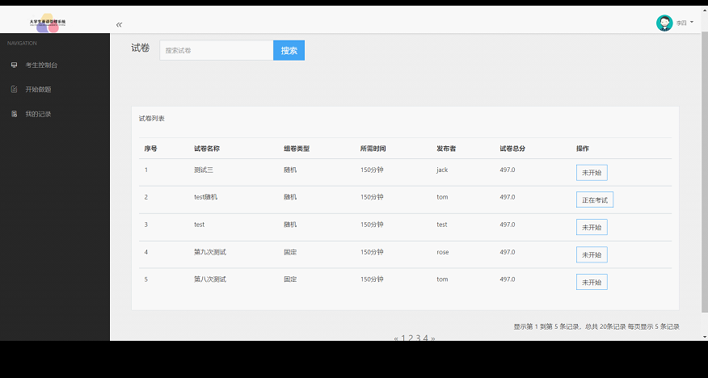
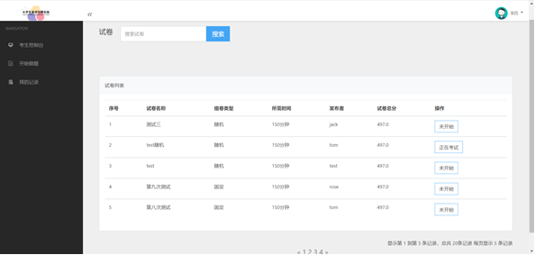
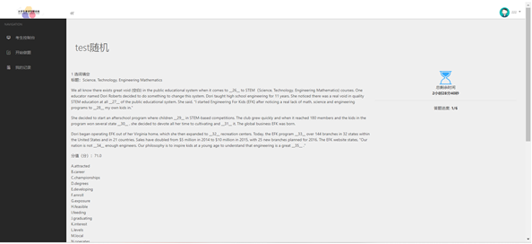

# english-exam
一个由SpringBoot+themelef的简单的大学生英语考试系统

前台是学生使用的界面，主要包括以下功能：注册、登录，学生需要注册并登录才能使用系统；登入之后可以考试，学生可以查看已经开始的考试，选择试卷进行作答，提交答案并自动批改；查看历史记录，学生可以查看做过的试卷记录，可以根据日期、科目等条件查询历史记录；还有个人中心，学生可以在个人中心修改个人信息、密码等，也可以参加课程和活动。
后台是老师使用的界面，主要包括以下功能：题库管理，老师可以在这里新增或者删除题目，并对题目进行分类和标签化；试卷管理，老师可以在题库中选择一定的题目作为试卷发不出去，设定试卷的时间和难度等级，也可以编辑已有试卷；老师可以进行学生用户管理，老师可以管理学生用户，包括添加、删除、修改学生信息等操作。查看学生的考试记录，老师可以查看所有学生的考试记录，包括答题情况、得分情况、用时情况等。

## 1.环境
jdk1.8+mysql8

## 2.项目展示
+ 考试详情页面

+ 考试页面

+ 按钮栏页面

+ 我的记录页面

+ 用户管理展示页面

+ 统计分析详情页面

有偿获得源码+Q：2369303335
